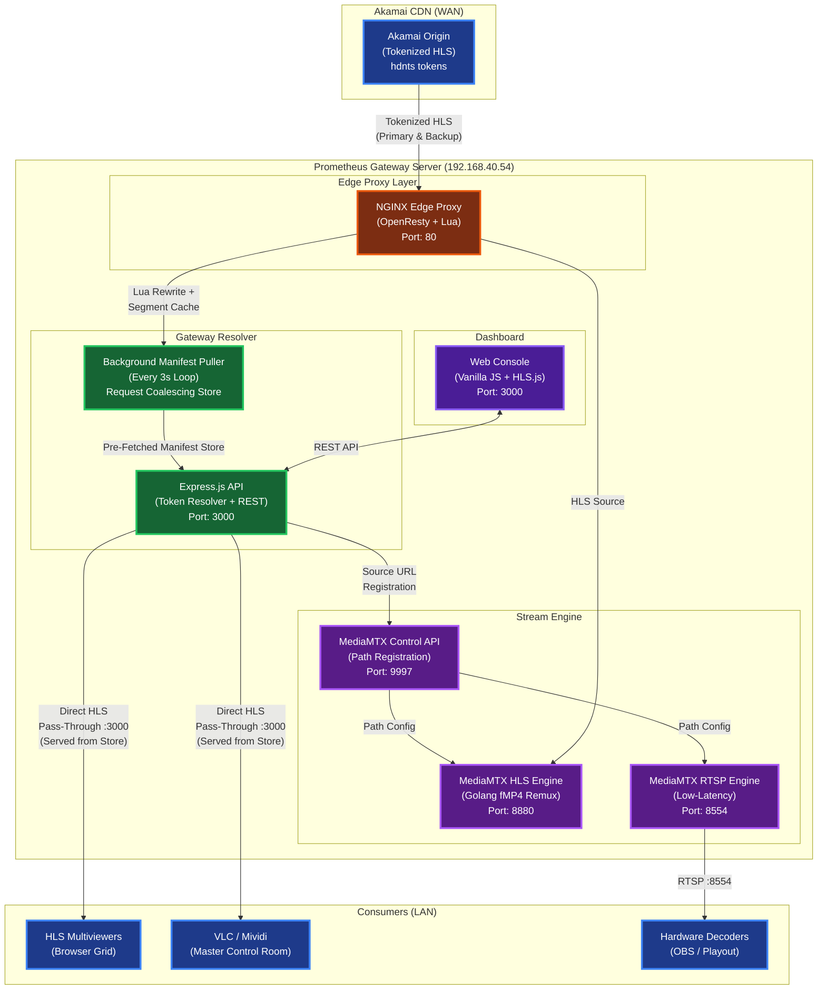
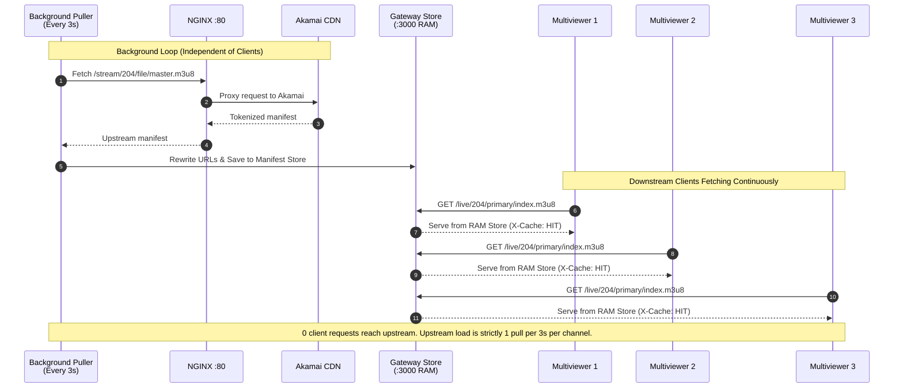
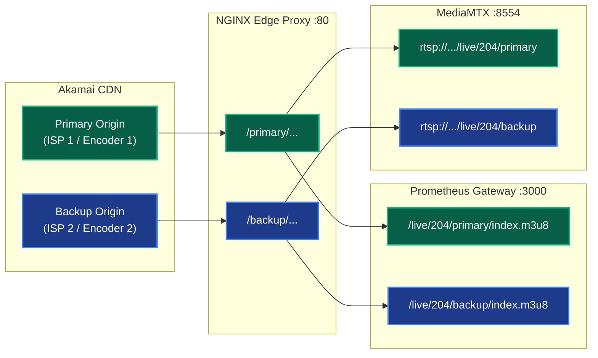

# Prometheus IP Stream Gateway

> **Protocol Redistribution & Optimized Media Engine for Token-Isolated HLS & Enterprise Utility Streaming**

> **v2.2.0**: Manifest TTL cache for upstream fan-out reduction, dual Primary/Backup ISP isolation, Direct HLS Pass-Through, RTSP redistribution, 49 active channel profiles.

---

## Features

### Core Capabilities

| Category | Features |
|----------|----------|
| **Upstream Fan-Out Reduction** | Reduces WAN bandwidth from `N × Multiviewers` upstream pulls to a **guaranteed constant pull count** via 3-second background manifest puller & request coalescing |
| **Zero Token Expiry** | Background resolver auto-refreshes Vidio/Akamai `hdnts` tokens every 15 minutes. Downstream clients connect to static local URLs that **never expire** |
| **Dual ISP Isolation** | Independent `/primary` (ISP 1) and `/backup` (ISP 2) sub-paths per channel for side-by-side hardware encoder monitoring |
| **Single-Encoder Detection** | Automatic `N/A` badge and bypass of backup probing/registration when `customBackupUrl` is blank |
| **Direct HLS Pass-Through** | Zero-demuxing manifest proxy on `:3000` that preserves Akamai's native fMP4 timestamps with **0 frame skips** and **0 timestamp resets** |
| **RTSP Redistribution** | MediaMTX-powered RTSP endpoints on `:8554` for hardware decoders and broadcast monitors |
| **Live Feed Inspector** | Built-in telemetry console with HLS.js player, instant Primary/Backup A/B switching, resolution/bitrate analytics |
| **Config Export & Import** | One-click JSON export and full-state replacement import (`POST /api/channels/import`) |
| **Search Filter Preservation** | UI search state maintained across 5-second background polling ticks |
| **Edge Segment Caching** | NGINX OpenResty proxy caches `.m4s` segments in RAM, serving repeated requests in sub-millisecond |

---

## Architecture

### System Overview



### Fan-Out Reduction Flow (Background Puller / Request Coalescing)



### Dual Primary & Backup ISP Flow



### Technology Stack

| Component | Technology | Purpose |
|-----------|------------|---------|
| **Backend** | Node.js 18 + Express 4 | Token resolver API, Direct HLS Pass-Through proxy, manifest cache |
| **Stream Engine** | MediaMTX (Golang) | RTSP/HLS/WebRTC fan-out with `sourceOnDemand` |
| **Edge Proxy** | OpenResty / NGINX | Lua token proxy, AV1 codec exclusion, RAM segment caching |
| **Frontend** | Vanilla JS + HLS.js | Telemetry dashboard, Live Feed Inspector, search/filter |
| **Typography** | Inter + JetBrains Mono | Sans-serif UI + monospace telemetry |
| **Container** | Docker Compose | Two-service orchestration on bridge network |
| **HTTP Client** | Axios | Upstream health probes, Vidio API, MediaMTX REST API |

---

## Port Allocations

| Port | Service | Description | Protocol |
|------|---------|-------------|:--------:|
| **`3000`** | **Gateway Resolver & REST API** | Control Dashboard, Channels API, Direct HLS Pass-Through (`/live/:id/:feed/index.m3u8`) with manifest TTL cache | HTTP |
| **`80`** | **NGINX Edge Proxy** | OpenResty Lua token proxy & AV1 exclusion (`/primary/...` & `/backup/...`), RAM segment cache | HTTP |
| **`8554`** | **MediaMTX RTSP Engine** | Low-latency RTSP endpoints (`rtsp://<SERVER_IP>:8554/live/:id/:feed`) | RTSP |
| **`8880`** | **MediaMTX HLS Engine** | Remuxed HLS endpoints (used internally by MediaMTX, not primary consumer path) | HTTP |
| **`9997`** | **MediaMTX Control API** | Internal REST API for dynamic path registration | HTTP |
| **`9998`** | **MediaMTX Metrics** | Prometheus metrics endpoint | HTTP |

---

## Stream Endpoints Guide

Downstream clients connect to **static local URLs that never expire**:

### HLS Endpoints (Port 3000 — Recommended)

| Channel | Primary HLS | Backup HLS |
|---------|-------------|------------|
| **SCTV** | `http://192.168.40.54:3000/live/204/primary/index.m3u8` | `http://192.168.40.54:3000/live/204/backup/index.m3u8` |
| **Indosiar** | `http://192.168.40.54:3000/live/205/primary/index.m3u8` | `http://192.168.40.54:3000/live/205/backup/index.m3u8` |
| **Trans TV** | `http://192.168.40.54:3000/live/733/primary/index.m3u8` | `http://192.168.40.54:3000/live/733/backup/index.m3u8` |
| **Bein 1** | `http://192.168.40.54:3000/live/6299/primary/index.m3u8` | `http://192.168.40.54:3000/live/6299/backup/index.m3u8` |

### RTSP Endpoints (Port 8554)

| Channel | Primary RTSP | Backup RTSP |
|---------|-------------|------------|
| **SCTV** | `rtsp://192.168.40.54:8554/live/204/primary` | `rtsp://192.168.40.54:8554/live/204/backup` |
| **Indosiar** | `rtsp://192.168.40.54:8554/live/205/primary` | `rtsp://192.168.40.54:8554/live/205/backup` |

> **URL Pattern**: Replace the channel ID in the URL to access any of the 49 configured channels.

---

## API Reference

| Method | Endpoint | Description |
|--------|----------|-------------|
| `GET` | `/api/channels` | Returns enriched list of all channels with primary/backup endpoints & health states |
| `POST` | `/api/channels` | Add a new channel profile with optional custom primary/backup URLs |
| `PUT` | `/api/channels/:id` | Update an existing channel profile configuration |
| `DELETE` | `/api/channels/:id` | Remove channel profile and deregister MediaMTX stream paths |
| `POST` | `/api/channels/:id/refresh` | Force-refresh tokenized Akamai URLs for a specific channel |
| `GET` | `/api/channels/export` | Download `channels.json` as a backup file |
| `POST` | `/api/channels/import` | Replace full channel configuration and sync MediaMTX instantly |
| `GET` | `/live/:id/:feed/index.m3u8` | Direct HLS Pass-Through with manifest TTL cache (fan-out reduction) |

---

## Build & Deploy

Run on destination host `192.168.40.54`:

```bash
# 1. Update repository
cd ~/prometheus-project && git pull origin main

# 2. Build and restart Gateway Resolver container
sudo docker compose up -d --build gateway-resolver

# 3. Restart MediaMTX container
sudo docker compose restart mediamtx
```

### Verify Cache is Working

```bash
# First request should return X-Cache: MISS
curl -sI http://192.168.40.54:3000/live/204/primary/index.m3u8 | grep X-Cache

# Second request within 2s should return X-Cache: HIT
curl -sI http://192.168.40.54:3000/live/204/primary/index.m3u8 | grep X-Cache
```

---

## Environment Variables

| Variable | Description | Default |
|----------|-------------|---------|
| `PORT` | Gateway API port | `3000` |
| `MEDIAMTX_API` | MediaMTX REST API endpoint | `http://mediamtx:9997` |
| `PROXY_HOST` | NGINX Edge Proxy address | `http://192.168.40.54:80` |
| `REFRESH_INTERVAL_MINUTES` | Token refresh cycle interval | `15` |
| `VIDIO_API_KEY` | Vidio API authentication key | *(optional)* |
| `VIDIO_USER_ID` | Vidio user ID for token resolution | *(optional)* |
| `VIDIO_VISITOR_ID` | Vidio visitor ID | *(optional)* |

---

## Background Timers

| Interval | Purpose |
|----------|---------|
| **2 seconds** | Manifest TTL cache expiry (per channel/feed) |
| **5 seconds** | Frontend UI polling for channel status updates |
| **8 seconds** | Background health-check probes on all primary & backup URLs |
| **10 seconds** | Auto-resync MediaMTX paths (recovery after container restarts) |
| **15 minutes** | Scheduled Vidio/Akamai token refresh cycle |

---

## Documentation & Knowledge Base

- **Product Requirement Document (PRD)**: [PROMETHEUS_PRD.md](./PROMETHEUS_PRD.md)
- **Agent Guidelines & Rules**: [AGENTS.md](./AGENTS.md)
- **Graphify Knowledge Graph**: [graphify-out/GRAPH_REPORT.md](./graphify-out/GRAPH_REPORT.md)
